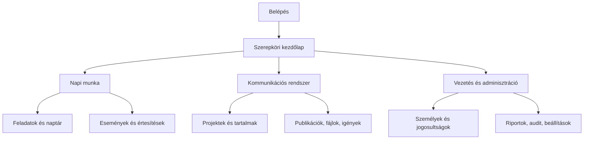

# Rátgéber Akadémia kommunikációs platform

## Képernyőnkénti funkcionális specifikáció és navigációs terv – 1.0

**Kapcsolódó dokumentumok:**

- MVP fejlesztési specifikáció 1.0
- Részletes adatmodell és Supabase RLS-specifikáció 1.0
- Állapotátmeneti, automatizmus- és értesítési mátrix 1.0

**Felület nyelve:** magyar  
**Célplatform:** reszponzív webalkalmazás és telepíthető PWA  
**Arculat:** Rátgéber Akadémia arculatához illeszkedő  
**Akadálymentességi cél:** WCAG 2.1 AA

---

## 1. Felületi alapelvek

1. A felhasználó csak olyan menüpontot és műveletet láthat, amelyhez tényleges szerveroldali jogosultsága van.
2. A fő művelet minden képernyőn vizuálisan egyértelmű, de kritikus vagy visszafordíthatatlan művelet megerősítést kér.
3. Az állapot, felelős, határidő és aktív blokk minden releváns adatlapon azonnal látható.
4. A felület ne kényszerítse a felhasználót technikai vagy jogi dokumentumok olvasására, ha számára elég egy státuszjelzés.
5. A mobilfelület a napi munkát teljes értékűen támogatja; komplex adminisztráció és részletes riport mobilon egyszerűsített.
6. A rendszer minden időpontot Europe/Budapest szerint jelenít meg.
7. Az automatikus mentés állapota mindig látható: „Mentés…”, „Mentve”, „Nincs kapcsolat”, „Ütközés”.
8. A felület nem mutat automatikus munkatársi rangsort vagy teljesítménypontot.
9. Az érzékeny tartalom megnyitása előtt a szükséges figyelmeztetés és újbóli hitelesítés nem kerülhető meg.
10. Minden üres állapot magyarázza el röviden, miért nincs adat, és kínálja fel a következő jogosult műveletet.

---

## 2. Vizuális és komponensrendszer

### 2.1. Alapelrendezés asztali nézetben

- bal oldali, összecsukható főnavigáció;
- felső sáv globális keresővel, gyors létrehozással, értesítésekkel és profilmenüvel;
- központi tartalomterület;
- részletező oldalsáv opcionális gyorsnézethez;
- kenyérmorzsa csak három vagy több navigációs szintnél.

### 2.2. Mobilnézet

- alsó navigáció legfeljebb öt elsődleges ponttal;
- „Továbbiak” menü a ritkábban használt modulokhoz;
- lebegő vagy rögzített fő művelet, ha a képernyőn indokolt;
- táblázatok kártyává törnek vagy vízszintesen görgethetők;
- kritikus figyelmeztetések nem kerülhetnek a hajtás alá.

### 2.3. Kötelező közös komponensek

- állapotjelvény;
- prioritásjelvény;
- személychip avatárral/monogrammal;
- határidőkijelző késedelmi állapottal;
- jogosultsági státusz: Rendben / Ellenőrizendő / Hiányzik / Korlátozott / Lejárt / Visszavont;
- fájl-előnézeti kártya;
- aktivitási idővonal;
- kommentmező `@név` említéssel;
- szűrősáv és mentett szűrő;
- megerősítő párbeszédablak;
- blokkpanel indokkal és felelőssel;
- üresállapot-komponens;
- hiba- és kapcsolatvesztési banner.

### 2.4. Szín és jelentés

A jelentés nem támaszkodhat kizárólag színre. Minden színkódhoz ikon és szöveg társul.

- zöld: rendben/teljesült;
- sárga: ellenőrizendő/figyelmeztetés;
- piros: blokk/hiba/visszavonás;
- kék: információ/folyamatban;
- szürke: lezárt/archivált/inaktív.

Az Akadémia arculati színei ezek árnyalatait és komponenshasználatát módosíthatják, de a kontrasztkövetelményt nem.

---

## 3. Információs architektúra

### 3.1. Főmenü

1. Kezdőlap
2. Feladatok
3. Naptár
4. Projektek
5. Tartalmak
6. Események
7. Fájlok
8. Igények
9. Személyek és jogosultságok
10. Riportok
11. Adminisztráció

Az értesítések, keresés, saját profil és hibabejelentés a felső sávból érhető el.

### 3.2. Mobil alsó navigáció

Szerepkörtől függően:

- Kezdőlap
- Feladatok
- Naptár
- Tartalmak vagy Projektek
- Továbbiak

Névadónál:

- Kezdőlap
- Fontos események
- Előkészített
- Publikált
- Profil

Külső közreműködőnél:

- Kezdőlap
- Feladataim
- Eseményeim
- Fájlok
- Profil

---

## 4. Képernyőjegyzék

| ID | Képernyő | Elsődleges szerepkör |
|---|---|---|
| AUTH-01 | Belépés | mindenki |
| AUTH-02 | Meghívás elfogadása | meghívott |
| AUTH-03 | Első fiók aktiválása | első két vezetői fiók |
| AUTH-04 | MFA beállítása és ellenőrzése | kiemelt szerepkörök |
| AUTH-05 | Jelszó-visszaállítás | e-mail/jelszó felhasználó |
| HOME-01 | Munkatársi kezdőlap | munkatárs |
| HOME-02 | Projektgazdai kezdőlap | projektgazda |
| HOME-03 | Kommunikációs vezetői kezdőlap | kommunikációs vezető |
| HOME-04 | Névadói kezdőlap | Rátgéber László |
| HOME-05 | Külső közreműködői kezdőlap | külső |
| TASK-01 | Feladatlista/Kanban | jogosult felhasználók |
| TASK-02 | Feladatadatlap | jogosult felhasználók |
| CAL-01 | Naptár | jogosult felhasználók |
| EVENT-01 | Eseménylista | jogosult felhasználók |
| EVENT-02 | Eseményadatlap/szerkesztő | jogosult felhasználók |
| PROJ-01 | Projektlista | jogosult felhasználók |
| PROJ-02 | Projektadatlap | projektcsapat |
| CONT-01 | Tartalomlista | jogosult felhasználók |
| CONT-02 | Tartalomadatlap | jogosult felhasználók |
| CONT-03 | Tartalomszerkesztő és verziók | szerkesztők |
| CONT-04 | Felülvizsgálati nézet | felülvizsgálók |
| PUB-01 | Publikáció rögzítése | publikáló |
| PUB-02 | Publikációs lenyomat | jogosultak |
| FILE-01 | Fájltár | jogosultak |
| FILE-02 | Fájladatlap és verziók | jogosultak |
| REQ-01 | Igénylista | befogadók/igénylő |
| REQ-02 | Igénylő űrlap | belső vagy tokenes külső |
| REQ-03 | Igényadatlap és döntés | befogadó |
| PERSON-01 | Személylista | jogosultak |
| PERSON-02 | Személyprofil | jogosultak |
| PERM-01 | Jogosultsági áttekintő | komm. vezető/adatvédelmi |
| PERM-02 | Jogosultsági rekord és dokumentum | komm. vezető/adatvédelmi |
| PERM-03 | Külső nyilatkozati űrlap | törvényes képviselő |
| PRIV-01 | Adatvédelmi ügylista/adatlap | komm. vezető/adatvédelmi |
| REPORT-01 | Vezetői összkép | komm. vezető |
| REPORT-02 | Publikációs riport | jogosultság szerint |
| REPORT-03 | Munkatársi/terhelési riport | komm. vezető/projektgazda |
| REPORT-04 | Névadói összesített riport | névadó |
| SEARCH-01 | Globális keresés | jogosult felhasználók |
| NOTIF-01 | Értesítési központ | minden aktív felhasználó |
| ADMIN-01 | Felhasználók és meghívások | tech admin/komm. vezető |
| ADMIN-02 | Szerepkörök és többletjogok | tech admin/komm. vezető |
| ADMIN-03 | Törzsadatok | komm. vezető |
| ADMIN-04 | Integrációk és rendszerállapot | tech admin |
| ADMIN-05 | Audit és hozzáférési napló | szerepkör szerint |
| ADMIN-06 | Import | jogosultság szerint |
| SUPPORT-01 | Hibabejelentés | minden aktív felhasználó |
| SUPPORT-02 | Hibajegyadatlap | bejelentő/tech admin |
| PROFILE-01 | Saját profil és értesítési beállítások | minden aktív felhasználó |

---

## 5. Hitelesítési képernyők

### AUTH-01 – Belépés

**Cél:** meglévő felhasználó biztonságos beléptetése.

**Elemek:**

- Rátgéber Akadémia logó és rendszermegnevezés;
- „Belépés Google-fiókkal”;
- e-mail;
- jelszó;
- „Elfelejtett jelszó”;
- adatkezelési és támogatási hivatkozás;
- rendszerállapot-jelzés csak szükség esetén.

**Szabályok:**

- nincs „Regisztráció” gomb;
- előzetes meghívás nélkül Google-belépés után sem jön létre aktív hozzáférés;
- hibaüzenet nem árulja el, hogy egy e-mail szerepel-e a rendszerben;
- öt sikertelen próbálkozás után fokozatos várakozás;
- kötelező MFA esetén AUTH-04 következik.

### AUTH-02 – Meghívás elfogadása

**Megjelenő adatok:** meghívott e-mail, szervezet, kijelölt szerepkör rövid leírása, lejárat.

**Választható út:**

1. Google-fiók kapcsolása;
2. jelszó létrehozása és e-mail-visszaigazolás.

**Kötelező:** név, adatkezelési tájékoztató elfogadása, jelszavas útnál megfelelő jelszó. Külső fióknál a lejárat jól látható.

### AUTH-03 – Első fiók aktiválása

Csak az első technikai admin és kommunikációs vezető egyszer használható aktiválókódjával érhető el.

**Lépések:** kód ellenőrzése → identitás → e-mail → belépési mód → e-mail-ellenőrzés → MFA → helyreállító kódok → kész.

Az aktiválókód sikeres használat után azonnal érvénytelen.

### AUTH-04 – MFA

- QR-kód és kézi TOTP-kulcs;
- hatjegyű ellenőrző kód;
- helyreállító kódok egyszeri megjelenítése és letöltése;
- későbbi belépésnél TOTP vagy helyreállító kód;
- MFA-visszaállítás kérésének indítása, saját kezű azonnali visszaállítás nélkül.

### AUTH-05 – Jelszó-visszaállítás

- e-mail megadása;
- semleges visszaigazolás;
- egyszer használható link;
- új jelszó kétszeri megadása;
- siker után korábbi munkamenetek megszüntetésének lehetősége.

---

## 6. Szerepköri kezdőlapok

### HOME-01 – Munkatársi kezdőlap

**Felső sáv:** dátum, személyre szabott köszöntés, gyors „Új igény” és jogosultság esetén „Új feladat”.

**Panelek:**

1. mai feladatok;
2. közelgő határidők;
3. visszaigazolásra váró kiosztások;
4. pontosításra váró feladatok;
5. mai és következő események;
6. olvasatlan értesítések.

Nem jelenik meg saját teljesítményértékelés vagy részletes statisztika.

### HOME-02 – Projektgazdai kezdőlap

A munkatársi panelek mellett:

- saját aktív projektek;
- projektenként késő és blokkolt feladatok;
- közelgő publikációk;
- válaszra váró eseménymeghívások;
- megjelenési jogosultsági problémák;
- csapatterhelés rövid, összehasonlítás nélküli nézete.

Minden számláló a mögöttes szűrt listára navigál.

### HOME-03 – Kommunikációs vezetői kezdőlap

**Első képernyőn látható:**

- kritikus és blokkolt tételek;
- publikálásra előkészített tartalmak;
- mai/közelgő publikációk;
- névadói kommentek;
- megjelenési jogosultsági kockázatok;
- aktuális késések;
- mai fontos események;
- technikai admin friss tartalmi hozzáférései;
- stábterhelési összkép.

**Gyors műveletek:** új projekt, új tartalom, új esemény, új feladat, új meghívás, riport.

### HOME-04 – Névadói kezdőlap

Különösen egyszerű, alacsony információsűrűségű nézet.

**Szekciók:**

- fontos közelgő események;
- publikálásra előkészített tartalmak;
- legutóbb publikált tartalmak;
- saját elfoglaltságok;
- saját korábbi kommentek.

**Műveletek:** tartalom megnyitása, komment küldése a kommunikációs vezetőnek, eseményválasz, elfoglaltság rögzítése.

Nem látható: belső munkafolyamat, feladatkiosztás, munkatársi adat, jogi dokumentum, teljes belső naptár.

### HOME-05 – Külső közreműködői kezdőlap

- saját nyitott feladatok;
- következő események;
- megosztott fájlok;
- lejáró fiók jól látható dátuma;
- kapcsolattartó.

Globális projekt- vagy személyböngészés nincs.

---

## 7. Feladatképernyők

### TASK-01 – Feladatlista és Kanban

**Nézetek:** lista és Kanban.

**Alapértelmezett munkatársi szűrő:** saját, nem lezárt feladatok.

**Szűrők:** állapot, projekt, tartalom, esemény, felelős – ha látható –, határidő, prioritás, blokk, felülvizsgálat, időszak.

**Listaoszlopok:** cím, projekt, felelős, állapot, prioritás, határidő, blokk, utolsó változás.

**Kanban-oszlopok:** Kiosztva, Elfogadva/Folyamatban, Pontosításra vár, Blokkolt, Felülvizsgálaton, Befejezett.

Drag-and-drop csak engedélyezett állapotátmenetet indíthat; kötelező adat esetén párbeszédablak nyílik.

**Tömeges művelet:** az MVP-ben csak kommunikációs vezetőnek és projektgazdának, azonos projekt hatókörében: felelős kijelölése, határidő és címke. Tömeges befejezés vagy törlés nincs.

### TASK-02 – Feladatadatlap

**Fejléc:** feladatkód, cím, állapot, prioritás, felelős, határidő.

**Szekciók:**

- leírás és elfogadási eredmény;
- kapcsolódó projekt/tartalom/esemény;
- kapcsolódó és függő feladatok;
- fájlok;
- blokk/pontosítás;
- opcionális becsült és tényleges ráfordítás;
- kommentek;
- előzmények.

**Műveletek szerepkörtől és állapottól függően:** Elfogadom; Pontosítást kérek; Akadályt jelzek; Munka megkezdése; Felülvizsgálatra átadás; Befejezés; Átadás; Határidő módosítása; Blokkolás/feloldás; Visszanyitás; Visszavonás.

Határidő-módosítás és átadás indok nélkül nem menthető.

---

## 8. Naptár és események

### CAL-01 – Naptár

**Nézetek:** hónap, hét, nap, lista.

**Rétegek:** saját események, projekt eseményei, fontos események, elfoglaltságok, Google foglaltsági idősávok.

**Adatvédelem:** más személy magán- vagy Google-eseménye csak „Foglalt” blokként jelenik meg.

**Műveletek:** esemény létrehozása, elfoglaltság rögzítése, saját meghívás megnyitása, szűrés projektre/típusra/személyre jogosultság szerint.

**Ütközés:** vizuális figyelmeztetés, nem blokkolás. Kötelező részvételnél az ütközés melletti meghívás indoklást kér.

### EVENT-01 – Eseménylista

Szűrők: típus, projekt, felelős, időszak, állapot, helyszín, saját részvétel, fontos a névadónak.

Lista: dátum/idő, esemény, típus, felelős, helyszín, válaszállapot, résztvevői összesítés.

### EVENT-02 – Eseményadatlap és szerkesztő

**Alapmezők:** cím, típus, felelős, projekt/tartalom, kezdés, befejezés, helyszín/online információ, leírás, kötelező részvétel, válaszadási határidő, névadói fontosság – csak kommunikációs vezető –, fájlok.

**Résztvevők:** belső felhasználó, külső közreműködő, sportoló/személy, külső meghívott.

**Válaszösszesítés:** elfogadta, elutasította, talán, válaszra vár, nem igényel választ.

**Kapcsolható kommunikációs teendők:** előzetes kommunikáció, fotó/videó, beszámoló, publikálás, nincs feladat.

**Lényeges módosításkor:** jól látható figyelmeztetés arról, hogy a válaszok visszaállnak és új értesítés megy.

**Kiküldetésblokk:** helyszín, indulás, érkezés, utazási idő, résztvevők, megjegyzés; költségadat nincs.

---

## 9. Projektek

### PROJ-01 – Projektlista

**Nézetek:** lista és kártya.

**Szűrők:** állapot, projektgazda, szezon, időszak, csapat, címke.

**Kártyaadatok:** cím, projektgazda, időszak, állapot, nyitott/késő/blokkolt feladatok, tartalmak és következő esemény.

**Létrehozás:** kommunikációs vezető vagy `create_project` jogú projektgazda.

### PROJ-02 – Projektadatlap

**Fejléc:** projektkód, cím, állapot, projektgazda, időszak, fő művelet.

**Fülek:**

1. Áttekintés
2. Tartalmak
3. Feladatok
4. Események
5. Csapattagok
6. Fájlok
7. Aktivitás
8. Projektstatisztika

**Áttekintés:** cél, leírás, címkék, következő mérföldkövek, kockázatok, rövid előrehaladás.

**Műveletek:** szerkesztés, tag hozzáadása, tartalom/feladat/esemény létrehozása, lezárás; archiválás és újranyitás csak kommunikációs vezetőnek.

Külső tag csak a kifejezetten megosztott adatrészt látja, nem a teljes projektadatlapot.

---

## 10. Tartalmak

### CONT-01 – Tartalomlista

**Nézetek:** lista és kártya.

**Szűrők:** állapot, elsődleges/kapcsolódó projekt, tartalomtípus, felelős, csatorna/célfelület, publikálási idő, csapat, címke, jogosultsági probléma, blokk, prioritás.

**Kártya:** cím, típus, projekt, tartalomgazda, állapot, tervezett publikálás, kötelező publikációs előrehaladás, jogosultsági jelzés, bélyegkép.

**Névadói lista:** kizárólag Publikálásra előkészített és Publikált állapot, belső működési adatok nélkül.

### CONT-02 – Tartalomadatlap

**Fejléc:** tartalomkód, cím, állapot, prioritás, projekt, tartalomgazda, tervezett publikálás, blokk.

**Fülek:**

1. Áttekintés
2. Szöveg és média
3. Feladatok
4. Események
5. Megjelenések
6. Jogosultságok
7. Kommentek
8. Előzmények

**Áttekintés:** összefoglaló, tartalomtípus, címkék, elsődleges és kapcsolódó projektek, kötelező célfelületek és előrehaladás.

**Jogosultságok fül projektgazdának:** személy, státusz, hatály, rövid korlátozás. Dokumentumlink nincs.

**Műveletek:** szerkesztés, verzió, review-kérés, előkészítetté jelölés, blokkolás/feloldás, másolás, lezárás, visszavonás, archiválás szerepkör szerint.

### CONT-03 – Tartalomszerkesztő és verziók

**Szerkesztőmezők:** munkacím, rövid összefoglaló, strukturált törzsszöveg, tartalomtípus, projektek, címkék, érintett személyek, tervezett megjelenés, kötelező/opcionális célfelületek, médiafájlok.

**Verziópanel:** verziószám, létrehozó, időpont, változás típusa, indok, összehasonlítás.

**Módosítástípus:**

- technikai/helyesírási;
- érdemi.

Érdemi módosításnál indoklás és jóváhagyásvesztési figyelmeztetés kötelező.

**Zárolás:** zároló neve és kezdete látható; kommunikációs vezető indoklással feloldhatja.

### CONT-04 – Felülvizsgálati nézet

**Cél:** az adott tartalomverzió döntésorientált ellenőrzése.

**Elemek:** teljes verzió, média-előnézet, korábbi verzióhoz képesti eltérés, ellenőrzés típusa, érintett személyek jogosultsági státusza, felülvizsgálati megjegyzés.

**Döntések:** Jóváhagyom; Változtatást kérek; Elutasítom – ha a szabály engedi. A döntés naplózódik.

---

## 11. Publikáció

### PUB-01 – Publikáció rögzítése

Csak belső, `publish_content` jogú felhasználónak.

**Lépések:**

1. célfelület kiválasztása;
2. tényleges publikációs idő;
3. publikált szöveg vagy leírás;
4. végleges fájlverziók;
5. bélyegkép/kontaktlap;
6. URL vagy kihagyási ok;
7. csatornaspecifikus adatok;
8. előnézet és véglegesítés.

**Csatornaspecifikus ellenőrzés:**

- Story platformelemeknél képernyőkép;
- belső kommunikációnál tárgy, teljes szöveg, feladó, célcsoport és létszám;
- sajtónál kiküldési adatok és sajtólista;
- nyomtatványnál PDF/fotó, példányszám, terjesztési adatok.

`Később kerül pótlásra` választás egyértelműen jelzi a 24 órás automatikus feladatot.

Mentés előtt a rendszer újraellenőrzi a blokkot, jogosultságot, fájlelérhetőséget és publikálói jogot.

### PUB-02 – Publikációs lenyomat

**Fejléc:** csatorna, célfelület, időpont, publikáló, státusz, URL.

**Tartalom:** publikált szöveg, média és bélyegkép, fájlverzió/ellenőrző összeg, csatornaspecifikus metaadatok, eredménymérések, verziótörténet.

**Műveletek:** URL-pótlás, dokumentált helyesbítés, eredményadat rögzítése, külső eltávolítás jelzése; közvetlen felülírás és törlés nincs.

---

## 12. Fájlok

### FILE-01 – Fájltár

**Nézetek:** rács és lista.

**Szűrők:** fájltípus, projekt, tartalom, feladat, esemény, tulajdonos, állapot, végleges verzió, tárolás (Supabase/NAS), időszak.

**Kártya:** bélyegkép/ikon, név, verzió, méret, tulajdonos, állapot, kapcsolódó rekord.

**Műveletek:** feltöltés, NAS-hivatkozás rögzítése, előnézet, kapcsolás, új verzió, lomtár/archiválás jogosultság szerint.

### FILE-02 – Fájladatlap és verziók

**Fejléc:** logikai fájlnév, állapot, tulajdonos, tárolási hely.

**Verziólista:** verzió, időbélyeges fájlnév, eredeti név, méret, MIME, SHA-256, feltöltő, vírusvizsgálat, végleges jelzés, kapcsolatok.

**Előnézet:** támogatott típusnál; videóbélyegkép cserélhető.

**NAS-panel:** hálózati útvonal maszkolt/megjelenített jogosultság szerint, utolsó ellenőrzés, elérhetőség, hibatörténet.

Karanténban vagy fertőzött állapotban letöltési gomb nincs.

---

## 13. Kommunikációs igények

### REQ-01 – Igénylista

Igénylő saját igényeit; kommunikációs vezető valamennyit; delegált projektgazda saját hatókörét látja.

Szűrők: állapot, igénylő, felelős, kívánt dátum, csapat/személy, igénytípus.

### REQ-02 – Igénylő űrlap

**Kötelező mezők:** igénylő, cél, rövid leírás, kívánt eredmény, kapcsolódó dátum/esemény, kívánt megjelenési idő, célcsoport, érintett csapat/személy, rendelkezésre álló anyagok, kapcsolattartó.

**Opcionális:** javasolt csatorna; ez nem köti a befogadót.

Külső személy csak e-mailhez kötött, egyszer használható linken érheti el.

### REQ-03 – Igényadatlap és döntés

**Szekciók:** teljes igény, mellékletek, pontosítási párbeszéd, határidők, aktivitás, kapcsolt megvalósítási rekord.

**Műveletek:** áttekintés átvétele, pontosítás kérése határidővel, elfogadás, elutasítás indoklással, átalakítás projektté/tartalommá/eseménnyé/feladattá, megvalósítottnak jelölés.

---

## 14. Személyek és megjelenési jogosultságok

### PERSON-01 – Személylista

Szűrők: személytípus, csapat, szezon, kiskorú/nagykorú, jogosultsági státusz, lejárat.

Projektgazda csak a saját projektjében releváns személy alapadatait és státuszát látja. Keresési találatban érzékeny adat nincs.

### PERSON-02 – Személyprofil

**Általános fejléc:** név, típus, csapat, aktív státusz, összesített megjelenési státusz.

**Jogosultság szerint látható fülek:**

- Alapadatok
- Csapatkapcsolatok
- Megjelenési jogosultságok
- Érintett tartalmak
- Törvényes képviselők
- Dokumentumok
- Előzmények

Projektgazda és stábtag számára a dokumentum- és képviselőfül nem jelenik meg.

Létrehozáskor név, születési év és csapat alapján duplikációs figyelmeztetés jelenik meg. Automatikus összevonás nincs.

### PERM-01 – Jogosultsági áttekintő

Kommunikációs vezető és adatvédelmi/jogi felelős számára.

**Gyorspanelek:** hiányzó, ellenőrizendő, hamarosan lejáró, visszavont, intézkedést igénylő korábbi publikációk.

**Szűrők:** személy, csapat, szezon, státusz, dokumentumtípus, lejárat, korlátozás.

### PERM-02 – Jogosultsági rekord és dokumentum

**Adatok:** hatály, engedélyezett média, csatorna és cél, korlátozás, ellenőrző, dokumentumverzió, visszavonás.

Dokumentum megnyitása előtt felugró adatvédelmi figyelmeztetés és szükség esetén újbóli hitelesítés. Megnyitás és letöltés naplózódik.

**Műveletek:** dokumentum feltöltése, ellenőrzés, Rendben/Korlátozott döntés, új nyilatkozatkérés, visszavonás, intézkedési lista.

Tömeges dokumentumletöltés nincs.

### PERM-03 – Külső nyilatkozati űrlap

Fiók nélküli, e-mailhez kötött, egyszer használható, hét napig érvényes link.

**Lépések:** érintett és képviselő adatainak ellenőrzése → tájékoztató → választások → összegzés → végleges beküldés → visszaigazolás.

Beküldés után az űrlap nem módosítható. Minősített elektronikus aláírás és igazolványmásolat nem szükséges.

### PRIV-01 – Adatvédelmi ügylista és adatlap

Lista: ügykód, típus, érintett, beérkezés, határidő, felelős, állapot.

Adatlap: kérelem, kapcsolt személy és adatok, intézkedési terv, feladatok, dokumentumok, határidő, lezárási összegzés, teljes audit.

Automatikus törlés gomb nincs.

---

## 15. Riportok

### REPORT-01 – Vezetői összkép

Kommunikációs vezetőnek.

**Panelek:** publikációs volumen, csatornamegoszlás, határidős teljesítés, aktív projektek, stábterhelés, jogosultsági kockázatok, javítási folyamatadatok, technikai hozzáférések.

Nincs rangsor. Minden diagram vagy mutató mögött tételes lista érhető el.

### REPORT-02 – Publikációs riport

**Szűrők:** hét/hónap/negyedév/szezon/év/egyedi, csatorna, célfelület, tartalomtípus, projekt, csapat, nem, téma, állapot, felelős, publikáló.

**Mutatók:** tartalmak, publikációk, kötelező megjelenések teljesülése, késések, lenyomathiány, javítások, eltávolítások, opcionális eredményadatok.

**Export:** XLSX, CSV, PDF; szűrők és exportáló feltüntetésével.

### REPORT-03 – Munkatársi és terhelési riport

Kommunikációs vezető teljes körben; projektgazda csak saját projektcsapatára.

**Külön panelek:** terhelés és teljesítés.

**Adatok:** kiosztott/befejezett/nyitott/blokkolt feladatok, határidős teljesítés, projektek, események, kiküldetések, utazási idő, esti/hétvégi munka, opcionális ráfordítás.

Javítási rész kizárólag kommunikációs vezetőnek. Munkatárs saját részletes riportot nem lát.

### REPORT-04 – Névadói összesített riport

Személynevek, egyéni teljesítés, javítási adatok és belső megjegyzések nélkül:

- tartalmak és publikációk időbeli alakulása;
- csatornák megoszlása;
- kiemelt projektek;
- összesített elérési/megtekintési adatok, ha rögzítve vannak.

---

## 16. Keresés és értesítések

### SEARCH-01 – Globális keresés

**Keresési tartomány:** projekt, tartalom, publikált szöveg, feladat, esemény, fájlnév/metaadat, személynév, címke, URL, jogosultan indexelt PDF/DOCX/TXT-szöveg.

**Találati csoportok:** típus szerint, darabszámmal.

**Találati elem:** cím, típus, rövid részlet, projekt, állapot, utolsó módosítás.

A részlet ugyanazt a jogosultságot igényli, mint a teljes rekord. Megjelenési dokumentum nem kerül a globális keresőbe. Külső közreműködőnek nincs globális kereső.

### NOTIF-01 – Értesítési központ

**Fülek:** Olvasatlan, Összes, Archivált.

**Szűrők:** típus, projekt, prioritás, időszak.

**Művelet:** megnyitás, olvasottnak jelölés. Nincs „elintézett” és „emlékeztessen később”.

Kritikus olvasatlan értesítés kiemelten jelenik meg, és nem archiválódik automatikusan.

---

## 17. Adminisztráció

### ADMIN-01 – Felhasználók és meghívások

**Technikai admin:** fiók, meghívó, felfüggesztés, inaktiválás, munkamenet-megszüntetés, technikai státusz.

**Kommunikációs vezető:** szerepkör és hatókör jóváhagyása, kinevezés és visszavonás.

Lista: név/e-mail, belső/külső, fiókállapot, szerepkör, MFA-státusz, lejárat, utolsó aktivitás.

**Meghívási folyamat:** tech admin megadja az e-mailt és kezdeményezi → kommunikációs vezető jóváhagyja a szerepet/hatókört → meghívó kiküldhető.

### ADMIN-02 – Szerepkörök és többletjogok

Előre definiált szerepkörök csak olvashatók. Felhasználóhoz rendelhető:

- szerepkör;
- projekt- vagy globális hatókör;
- kezdő és záró idő;
- többletjog;
- kinevezési/visszavonási indok.

Aktív névadó szerepkörből csak egy lehet.

### ADMIN-03 – Törzsadatok

Kommunikációs vezető kezeli:

- szezonok;
- csapatok;
- csatornák;
- publikációs célfelületek;
- tartalom- és eseménytípusok;
- címkék és címkejavaslatok;
- média- és felhasználási célkódok.

Használt törzsadat nem törölhető, csak inaktiválható.

### ADMIN-04 – Integrációk és rendszerállapot

Technikai admin nézete:

- Google OAuth/Calendar állapot;
- e-mail-szolgáltatás;
- PWA-push;
- Storage és előnézetfeldolgozás;
- vírusellenőrzés;
- NAS-elérhetőség;
- háttérfeladatok;
- mentés és legutóbbi visszaállítási próba.

Kommunikációs tartalom nem jelenik meg. Hibás komponensnél hibaazonosító és technikai diagnosztika látható.

### ADMIN-05 – Audit és hozzáférési napló

Szerepkör szerint szűrt nézet:

- kommunikációs vezető: üzleti és hozzáférési napló;
- technikai admin: technikai és biztonsági napló;
- adatvédelmi/jogi: személyesadat- és dokumentumhozzáférési napló.

Szűrők: időszak, felhasználó, eseménytípus, objektum, projekt, kritikus jelző. Auditbejegyzés nem módosítható.

### ADMIN-06 – Import

**Lépések:** fájl feltöltése → importtípus → mezőleképezés → előnézet → hibalista/duplikáció → jóváhagyás → végrehajtás → eredmény.

Helyes és hibás sorok külön láthatók. Személyes/jogosultsági import csak érzékeny importjoggal.

---

## 18. Hibabejelentés és profil

### SUPPORT-01 – Hibabejelentés

**Mezők:** cím, leírás, várt/tényleges működés, prioritási javaslat, képernyőkép vagy fájl, érzékeny tartalom jelző.

Automatikusan csatolható: alkalmazásverzió, böngésző, eszköztípus, aktuális képernyő azonosítója, korrelációs hibaazonosító. Jelszó, token és teljes érzékeny tartalom nem gyűjthető automatikusan.

### SUPPORT-02 – Hibajegyadatlap

Bejelentő: állapot, kommunikáció, megoldás. Tech admin: technikai részletek, prioritás, hozzárendelés, állapotváltás. Érzékeny melléklet csak korlátozott körnek.

### PROFILE-01 – Saját profil

**Fülek:** Alapadatok; Belépés és biztonság; Kapcsolt Google-fiók/naptár; Értesítések; Eszközök; Első belépési bemutató újraindítása.

**Értesítési beállítás:** normál e-mail/push típusonként; kötelező biztonsági, fiók-, jogosultsági és kritikus értesítések nem kapcsolhatók ki.

**Eszközök:** aktív munkamenetek és push-eszközök visszavonása.

---

## 19. Technikaiadmin-tartalommegnyitási felület

Ez nem önálló menüpont, hanem védett köztes képernyő.

### 19.1. Első lépés – hozzáférés kérése

- célrekord azonosítója és típusa;
- technikai hiba vagy támogatási jegy;
- kötelező indoklás;
- tájékoztatás: a megnyitás naplózódik és a kommunikációs vezető értesítést kap.

### 19.2. Második lépés – minden megnyitás előtti felugró üzenet

Javasolt szöveg:

> Védett kommunikációs tartalmat készülsz megnyitni. A hozzáférésed, annak indoka és időpontja naplózásra kerül, a kommunikációs vezető pedig azonnali értesítést kap. Csak a technikai feladat elvégzéséhez szükséges adatokat használd.

Gombok: **Mégsem**; **Megnyitom és tudomásul veszem**.

Az engedély egyszeri, adott rekordra szól és öt perc után lejár.

---

## 20. Reszponzív viselkedés

### 20.1. Teljes mobilfunkció

- feladat megnyitása, elfogadása és állapotváltása;
- esemény és meghívás;
- tartalom megtekintése és egyszerű szerkesztése;
- fotó, videó és dokumentum feltöltése;
- publikáció rögzítése;
- komment és említés;
- értesítés;
- jogosultsági státusz ellenőrzése;
- igénybejelentés;
- saját profil.

### 20.2. Mobilon egyszerűsített

- részletes vezetői riport;
- összetett importmező-leképezés;
- auditnapló tömeges áttekintése;
- nagy törzsadat-karbantartás;
- többoszlopos verzió-összehasonlítás.

Ezek mobilon olvashatók vagy alapműveletekkel kezelhetők, de teljes értékű munkához asztali nézet ajánlott.

### 20.3. Offline

- utoljára megnyitott alapadat korlátozottan megjelenhet;
- módosítás, komment, állapotváltás és publikáció nem küldhető be internet nélkül;
- a felület egyértelműen jelzi, hogy a látott adat elavult lehet;
- feltöltés megszakadás után folytatható.

---

## 21. Akadálymentességi követelmények

- minden művelet billentyűzettel elérhető;
- fókuszsorrend logikus és látható;
- modal megnyitásakor fókuszcsapda, bezáráskor fókuszvisszaadás;
- minden mezőnek programozott címkéje és értelmezhető hibája van;
- státusz nem csak színnel jelenik meg;
- képekhez alternatív szöveg adható;
- dekoratív képek rejtve a képernyőolvasó elől;
- célméret érintőképernyőn legalább 44×44 CSS-pixel;
- nagyítás 200%-ig tartalomvesztés nélkül;
- animáció csökkenthető rendszerbeállítás alapján;
- időkorlátos munkamenet lejárata előtt figyelmeztetés;
- táblázatok fejlécei és összefüggései programozottak.

---

## 22. Általános validációs és hibaállapotok

### 22.1. Mezőhiba

- a mező alatt konkrét magyar hibaüzenet;
- összegzés az űrlap tetején több hiba esetén;
- hibás mezőre fókusz;
- felhasználói adat nem vész el.

### 22.2. Jogosultsági hiba

Nem jelenhet meg érzékeny részlet. Üzenet:

> Ehhez az elemhez vagy művelethez nincs jogosultságod, vagy a hozzáférés időközben megváltozott.

### 22.3. Párhuzamos módosítás

A felhasználó lássa:

- ki módosította;
- mikor;
- saját nem mentett változatát;
- a friss verzió betöltésének vagy saját szöveg másolásának lehetőségét.

Automatikus csendes felülírás nincs.

### 22.4. Integrációs hiba

Google, NAS, e-mail vagy push hibája nem akadályozhatja indokolatlanul a belső rekord mentését. A rendszer külön jelzi, mi mentődött el és melyik külső művelet nem sikerült.

### 22.5. Betöltési állapot

- rövid műveletnél skeleton;
- hosszabb műveletnél folyamatjelző;
- import/export/fájlfeltöltés háttérben folytatható;
- az eredmény értesítésként megérkezik.

---

## 23. Gyors létrehozás

A felső sáv „+” menüje szerepkörtől függően kínálja:

- új feladat;
- új esemény;
- új tartalom;
- új projekt;
- új kommunikációs igény;
- új személyprofil;
- új felhasználói meghívás.

Mobilon csak a három leggyakrabban használt, jogosult művelet jelenjen meg közvetlenül; a többi a „Továbbiak” alatt.

Gyors létrehozás után a teljes adatlap nyílik meg; a rendszer csak a minimálisan szükséges adatot kérje az első mentéshez.

---

## 24. Első belépési bemutató

Szerepkörhöz igazított, legfeljebb 5–7 lépés:

1. kezdőlap és napi teendők;
2. feladat visszaigazolása;
3. naptár és elfoglaltság;
4. értesítések;
5. fájlfeltöltés vagy szerepköri fő művelet;
6. segítség és hibabejelentés;
7. mobil/PWA telepítés opcionálisan.

Átugorható, később a profilból újraindítható.

---

## 25. Képernyőszintű analitika és naplózás

Nem készül munkatársi megfigyelési vagy kattintásszám-alapú teljesítményértékelés.

Technikai célból gyűjthető minimalizált esemény:

- képernyőazonosító;
- betöltési idő;
- technikai hiba;
- alkalmazásverzió;
- eszköz- és böngészőkategória;
- anonimizált munkamenetazonosító.

Tartalmi mezőérték, komment, dokumentumszöveg és személyes adat analitikai eseménybe nem kerülhet.

---

## 26. Képernyőspecifikációs elfogadási kritériumok

### 26.1. Navigáció

- [ ] minden szerepkör csak engedélyezett menüpontot lát;
- [ ] közvetlen URL-lel sem nyitható meg tiltott képernyő;
- [ ] vissza- és mélylinkelés működik;
- [ ] mobil alsó navigáció legfeljebb öt elemes;
- [ ] a névadói és külső nézet nem mutat globális belső navigációt.

### 26.2. Napi munka

- [ ] új feladat visszaigazolható három meghatározott válasszal;
- [ ] határidő indok nélkül nem módosítható;
- [ ] blokk és feloldás szükséges adatokat kér;
- [ ] eseményütközés figyelmeztet, de nem blokkol;
- [ ] lényeges eseménymódosítás új visszaigazolást jelez;
- [ ] mobilról fájl feltölthető és folytatható.

### 26.3. Tartalom és publikáció

- [ ] kötelező célfelületek előrehaladása látható;
- [ ] nincs „Részben publikált” tartalomállapot;
- [ ] érdemi módosítás jóváhagyásvesztést jelez;
- [ ] publikáció mentése előtt minden feltétel szerveroldalon újraellenőrzött;
- [ ] lenyomat közvetlenül nem szerkeszthető;
- [ ] Story platformelemeknél képernyőkép bekérése működik;
- [ ] URL-pótlási feladat következménye előre látható.

### 26.4. Jogosultság és adatvédelem

- [ ] projektgazda nem lát jogi dokumentumot;
- [ ] stábtag csak egyszerű publikálhatósági jelzést lát;
- [ ] dokumentummegnyitás figyelmeztetést és auditot készít;
- [ ] technikai admin minden megnyitás előtt felugró üzenetet kap;
- [ ] kommunikációs vezető technikaiadmin-megnyitásról azonnal értesül;
- [ ] névadói komment csak kommunikációs vezetőnek látható;
- [ ] külső fiók lejárata és korlátozott hatóköre látható.

### 26.5. Minőség

- [ ] WCAG 2.1 AA alapellenőrzés teljesül;
- [ ] 200%-os nagyításnál nincs tartalom- vagy funkcióvesztés;
- [ ] a négy támogatott asztali böngésző aktuális és előző verziójában működik;
- [ ] aktuális Androidon és iOS-en a napi műveletek működnek;
- [ ] normál lista- és adatlapbetöltések 95%-a három másodpercen belüli;
- [ ] kapcsolatvesztés és párhuzamos szerkesztés nem okoz csendes adatvesztést.

---

## 27. Drótvázkészítés javasolt sorrendje

1. globális alkalmazáskeret és navigáció;
2. kommunikációs vezetői kezdőlap;
3. munkatársi kezdőlap;
4. feladatlista és feladatadatlap;
5. tartalomlista, adatlap és szerkesztő;
6. publikáció rögzítése és lenyomat;
7. naptár és eseményadatlap;
8. projektadatlap;
9. személyprofil és jogosultsági felület;
10. névadói kezdőlap és tartalomnézet;
11. külső közreműködői felület;
12. riportok;
13. adminisztráció;
14. mobilváltozatok;
15. üres, betöltési, hiba- és tiltott állapotok.

---

## 28. Kész definíció

A képernyő- és navigációs réteg akkor tekinthető specifikáltnak és implementálhatónak, ha:

1. minden képernyőhöz route, jogosultsági guard és adatforrás rendelhető;
2. minden látható művelet megfeleltethető egy engedélyezett RPC-nek vagy biztonságos CRUD-műveletnek;
3. minden kötelező, feltételes és csak olvasható mező azonosított;
4. a névadó, külső közreműködő és technikai admin elkülönített adatszűrése tesztelhető;
5. mobilon a napi munkafolyamatok végigvihetők;
6. az üres, hiba-, betöltési, kapcsolatvesztési és párhuzamos szerkesztési állapotok megtervezettek;
7. az akadálymentességi követelmények komponensszinten érvényesülnek;
8. a 26. fejezet elfogadási kritériumai teljesülnek.

E dokumentum alapján elkészíthető a tényleges UI-komponensjegyzék, a drótváz, a fejlesztési backlog és a képernyőkhöz kapcsolódó végpontlista.
